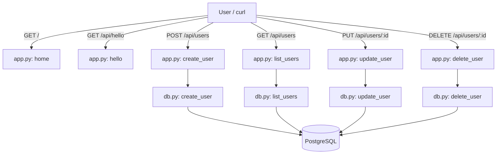
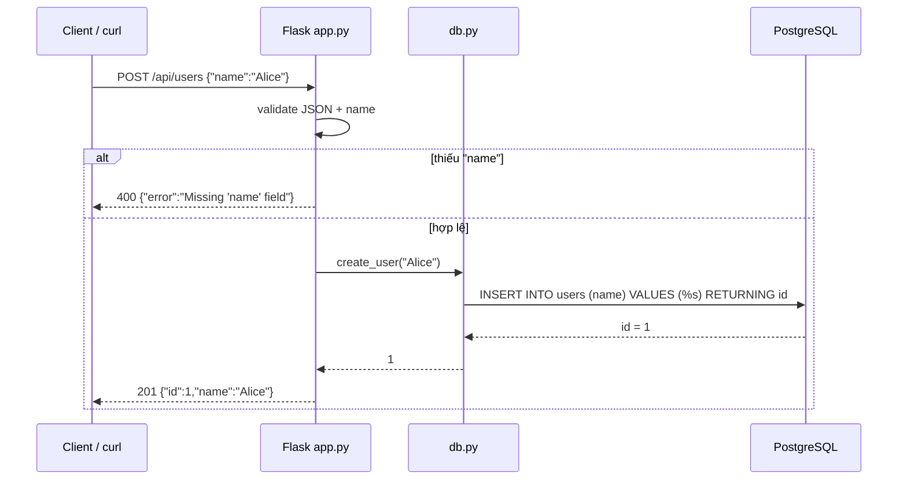
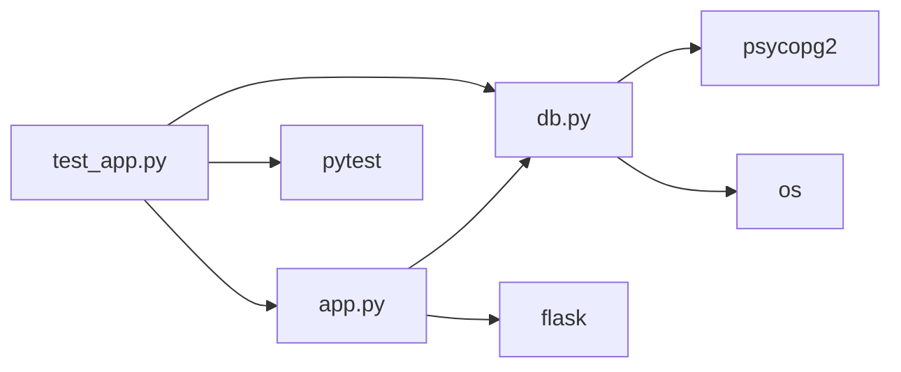

# 🏗️ Kiến trúc Capstone Flask — sơ đồ trực quan

> File này dùng **Mermaid** — mở trong VS Code có extension *Markdown Preview Mermaid Support*
> rồi bấm Preview (hoặc xem trực tiếp trên GitHub) để thấy sơ đồ vẽ ra.

---

## 1. Sơ đồ tổng thể (endpoints → functions → database)



## 2. Luồng 1 request POST (sequence diagram)



## 3. Dependency graph (module nào phụ thuộc module nào)



## 4. Bảng endpoints chi tiết

| Method | Route | Hàm trong app.py | Gọi db.py | Thành công | Lỗi |
|---|---|---|---|---|---|
| GET | `/` | `home` | — | 200 text | — |
| GET | `/api/hello` | `hello` | — | 200 JSON | — |
| GET | `/api/users` | `list_users` | `list_users` | 200 list | — |
| POST | `/api/users` | `create_user` | `create_user` | 201 | 400 |
| PUT | `/api/users/:id` | `update_user` | `update_user` | 200 | 400, 404 |
| DELETE | `/api/users/:id` | `delete_user` | `delete_user` | 200 | 404 |

## 5. Cấu trúc project

```
capstone-flask/
├── app.py          # routes (tầng HTTP)
├── db.py           # tầng database (PostgreSQL)
├── test_app.py     # pytest tests
├── render.yaml     # blueprint deploy (web + Postgres)
├── Procfile        # gunicorn app:app
├── requirements.txt
├── AGENTS.md
└── README.md / DEPLOY.md / ARCHITECTURE.md (file này)
```

---

## 💡 Mẹo: tự sinh sơ đồ bằng AI (Cline/DSH)

Chỉ cần hỏi AI:
> "Đọc project capstone-flask, vẽ sơ đồ kiến trúc bằng Mermaid:
> - flowchart endpoints → functions → database
> - sequence diagram cho POST /api/users"

AI sẽ tự phân tích code và tạo Mermaid như trên — bạn chỉ cần paste vào file `.md` và preview!
