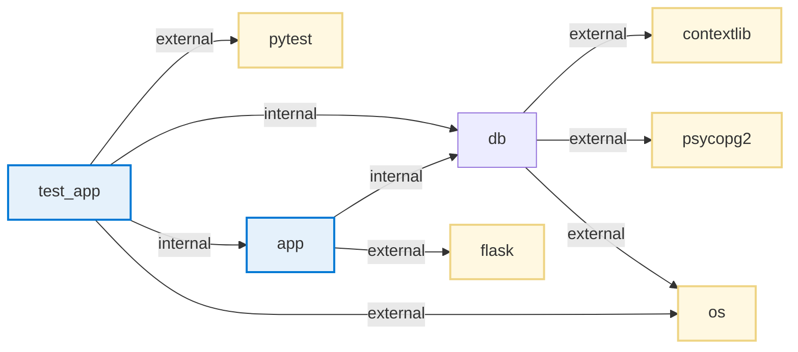

# 📊 Dependency graph tu dong (sinh boi script)

```mermaid
graph LR
    app -->|internal| db
    app -->|external| flask
    db -->|external| contextlib
    db -->|external| psycopg2
    db -->|external| os
    test_app -->|external| pytest
    test_app -->|internal| db
    test_app -->|internal| app
    test_app -->|external| os

    classDef internal fill:#e5f1fb,stroke:#0078d4,stroke-width:2px;
    classDef external fill:#fff8e1,stroke:#eed484,stroke-width:2px;
    class app,test_app internal;
    class contextlib,flask,os,psycopg2,pytest external;
```

> Tu dong sinh: 9 phu thuoc tu 4 file.